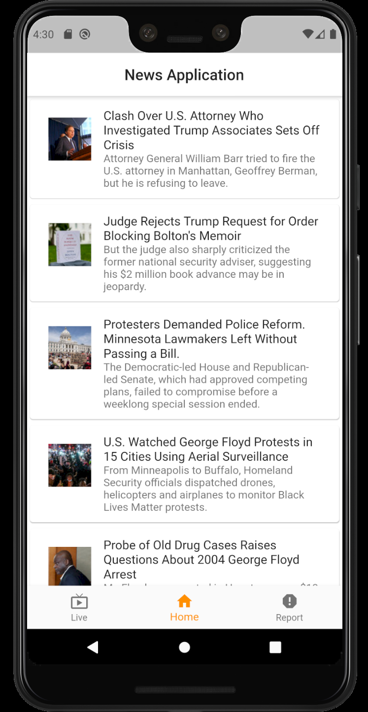
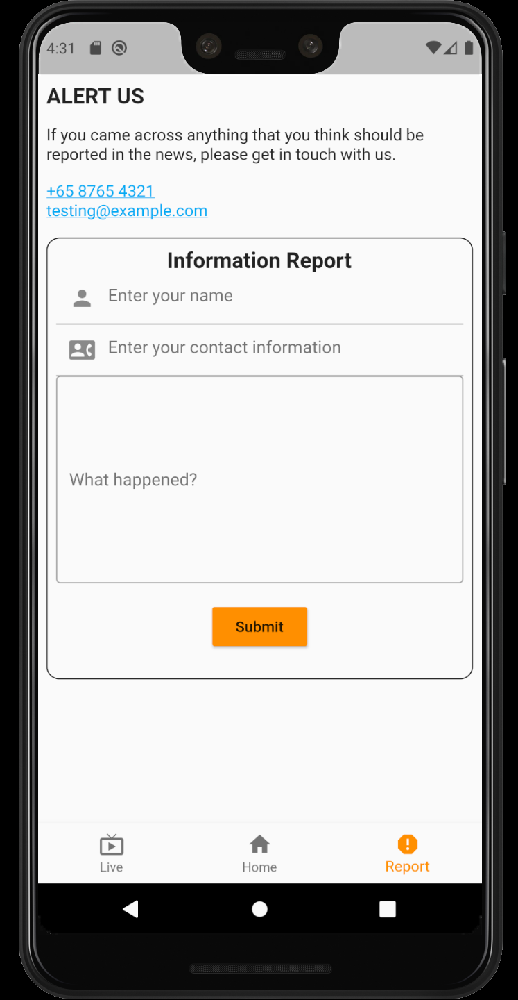
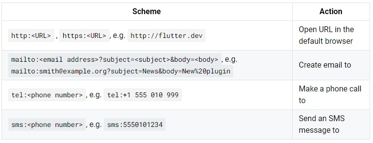

# Flutter - news_app

A news application with 3 main pages. Explores into fundamental features that most applications will use and how this features can be built easily with flutter.

## Screenshots - App showcase

    
    
    

 

    
    
    

## Set-up
Create a dart file "keys.dart" in lib/keys.dart. This file stores your NYTimes API key which can be created through [NYTimes API](https://developer.nytimes.com/). We will be using "Top Stories API" from there, so do enable it.

Create a constant "const nytimesApiKey = 'YOUR-API-KEY';" in the newly created keys.dart file. The application is now ready!

## Quick Guide to typical features

1. HTTP GET request 

    This is used in homepage for invoking NYTimes API which returns a JSON. Relevant files: services.dart, nytimes.dart

    - To create nytimes.dart, we can make use of sites such as [quicktype.io](https://app.quicktype.io/) which converts the JSON string into dart objects. 
    - services.dart creates simple methods to make async request.

2. Opening URL/Email/Phone
    
    This is used in homepage for opening url of articles to display the articles. It is also used in report page to launch email and phone. Relevant files: util.dart

    - In this application, it is done through [url_launcher](https://pub.dev/packages/url_launcher#-readme-tab-) plugin.
    - "launch" method in url_launcher with the relevant scheme added will trigger the respective actions.
    - "forceWebView" parameter in "launch" method when set to true will allow webpage to be opened in app while false will open webpage in the device's browser
    

3. Embedding Youtube Video

    This is used in live page for embedded the youtube video. 

    - In this application, it is done through [youtube_player_flutter](https://pub.dev/packages/youtube_player_flutter) plugin
    - No API key needed for youtube using this plugin

4. Forms 

    This is used in report page. Relevant files: reportForm.dart

    - TextFormField() provides text input for users. The following stackoverflow/flutter resources are useful information:
        - [Styling](https://stackoverflow.com/questions/50122394/not-able-to-change-textfield-border-color)
        - [Keyboard Adjustments](https://stackoverflow.com/questions/49577781/how-to-create-number-input-field-in-flutter)
        - [Validation](https://flutter.dev/docs/cookbook/forms/validation)
    - Controllers (e.g. TextEditingController()) will, as the name suggests, control the relevant FormField (e.g. TextFormField()) and allow for features such as extracting of the text

## Flutter learning resources

A few resources to get you started if this is your first Flutter project:

- [Lab: Write your first Flutter app](https://flutter.dev/docs/get-started/codelab)
- [Cookbook: Useful Flutter samples](https://flutter.dev/docs/cookbook)

For help getting started with Flutter, view our
[online documentation](https://flutter.dev/docs), which offers tutorials,
samples, guidance on mobile development, and a full API reference.
